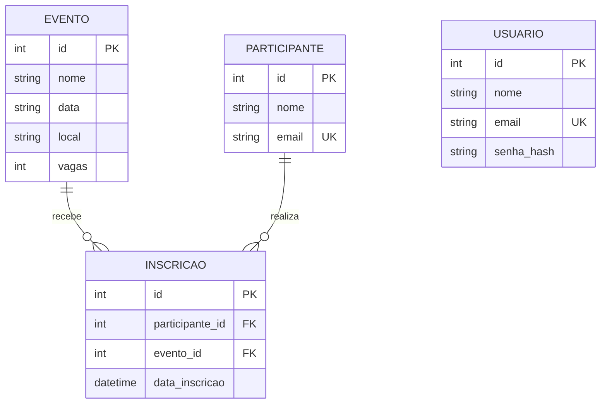

# DER simplificado

```mermaid
erDiagram
    EVENTO ||--o{ INSCRICAO : recebe
    PARTICIPANTE ||--o{ INSCRICAO : realiza
    EVENTO {
        int id PK
        string nome
        string data
        string local
        int vagas
    }
    PARTICIPANTE {
        int id PK
        string nome
        string email UK
    }
    INSCRICAO {
        int id PK
        int participante_id FK
        int evento_id FK
        datetime data_inscricao
    }
    USUARIO {
        int id PK
        string nome
        string email UK
        string senha_hash
    }
```

O par participante_id e evento_id é único. Usuario é uma entidade independente de autenticação.
